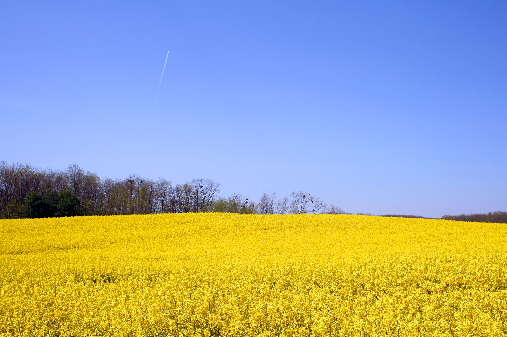

<h1 align="center">AgriView</h1>

Offers over 6,500 high quality images on an agricultural theme.

**[Access the application here.]**

---

## Index 

- <a href="#ux">1. User experience (UX)</a>
  - <a href="#ux-goals">1.1. Project goals</a>
  - <a href="#ux-stories">1.2 User stories</a>
  - <a href="#ux-design">1.3 Design</a>
  - <a href="#info-architecture">1.4 Information architecture</a>
  - <a href="#wireframes">1.5 Wire Frames</a>
   -<a href="#navigation-structure">1.6 Navigation Structure</a>
- <a href="#features">2. Features</a>
  - <a href="#features-existing">2.1 Features Implemented</a>
  - <a href="#features-future">2.2 Features for future implementation</a>
- <a href="#technologies-used">3. Technologies used</a>
- <a href="#testing">4. Testing</a>
- <a href="#deployment">5. Deployment</a>
- <a href="#credits">6. Credits</a>
- <a href="#acknowledgements">7. Acknowledgements</a>
- <a href="#disclaimer">8. Disclaimers</a>

<h1>1. User experience (UX)</h1>

Users are able to view a range of high quality agrculturally themed images.

Users are able to purchase images either individually or as part of a subscription service.

Users are able to set-up, login and logout of a secure account.

Users are able to request images not yet featured by providing a description of the content.

The site owner is able to collect a licence revenue

The site owner is able to add and remove images as required

The site owner is able to see a list of sales, the number of image downloads

