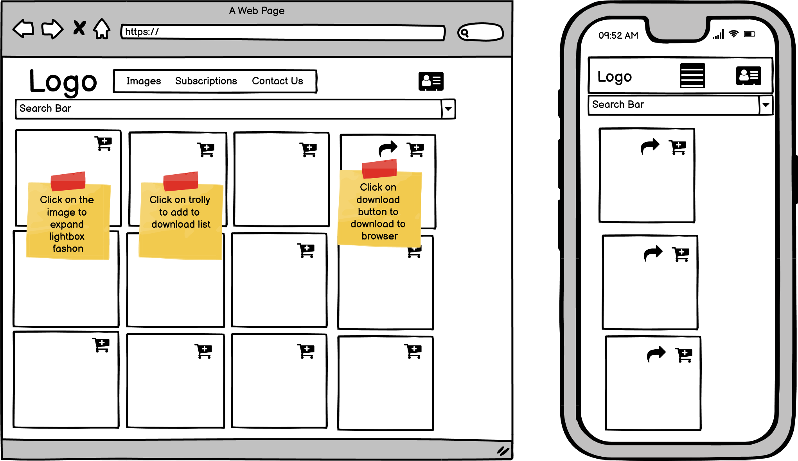

<h1 align="center">AgriView</h1>

Offers over 6,500 high quality images on an agricultural theme.

**[https://agri-image.herokuapp.com](Agri_view)**

---

## Index 

- <a href="#ux">1. User experience (UX)</a>
  - <a href="#ux-goals">1.1. Project goals</a>
  - <a href="#ux-stories">1.2 User stories</a>
  - <a href="#ux-design">1.3 Design</a>
  - <a href="#info-architecture">1.4 Information architecture</a>
  - <a href="#wireframes">1.5 Wire Frames</a>
   - <a href="#navigation-structure">1.6 Navigation Structure</a>
- <a href="#features">2. Features</a>
  - <a href="#features-existing">2.1 Features Implemented</a>
  - <a href="#features-future">2.2 Features for future implementation</a>
- <a href="#technologies-used">3. Technologies used</a>
- <a href="#testing">4. Testing</a>
- <a href="#deployment">5. Deployment</a>
- <a href="#credits">6. Credits</a>
- <a href="#acknowledgements">7. Acknowledgements</a>
- <a href="#disclaimer">8. Disclaimers</a>

<h1>1. User experience (UX)</h1>

<h2>1.1 Project goals</h1>

- Users are able to view a range of high quality agrculturally themed images.

- Users are able to purchase images either individually or as part of a subscription service.

- Users are able to set-up, login and logout of a secure account.

- Users are able to request images not yet featured by providing a  description of the content.

- The site owner is able to collect a licence revenue

- The site owner is able to add and remove images as required

- The site owner is able to see a list of sales, the number of image downloads

<h2>1.2 User Stories</h1>

| No. | As a|I WANT TO BE ABLE TO|SO THAT I CAN|App Name|
|---|---|---|---|---|
|1.|Site Owner|Provide customer and potential customers with a a web site that is inviting, easy to navigate and responsive|access the web site using different devices|**home**|
|2.|Visitor/Customer|Search for available images|quickly identify the image/images that I wish to purchase/download|**home**|
|3.|Visitor/Customer|Vew a selected image  and associated details |Determine whether the image will fit my application|**image**|
|4.|Customer|Register for an account|Have a personal account so that I can view my profile |**profile**|
|5.|Customer/ Site Owner|Login and logout securely|Access my personal account information|**profile**|
|6.|Customer|Recover my password in case I forget it|Recover my access to my account|**profile**|
|7.|Customer|Receive an email confirming that my account has been sucessfuly created |Verify that my account was successfully created|**profile**|
|8.|Customer|Be informed as to how many credits I have remaining|Purchase more credits if required|**profile**|
|9.|Customer|Enter my corporate address details |Receive confirmation of my purchases|**profile**|
|10.|Site Owner|Reward customers for registering their contact details by offering them free image download credits|Expand my understanding of the customers using this site|**profile**|
|11.|Customer|Be informed as to how many trees my image downloads have planted|I feel that I am benefiting the planet by purchasing my images from this site|**profile**|
|12.|Customer|Select from one of a number of subscription packages offered by the Site Owner|Select from one of a number of subscription packages offered by the Site Owner|**pricing**
|13.|Customer|View the contents of my basket prior to purchasing|Confirm that I have chosen the correct subscription or the correct images before paying for them|**pricing**|
|14.|Customer|Remove items from my basket prior to entering payment details|Change my mind prior to the final step of entering my payment details|**pricing**|
|15.|Customer|Pay for the subscription option using a credit card|Pay for the chosen subscription package or individual images|**pricing**|
|16.|Customer|Receive an email confirming my purchase|Have a record of my past purchases|**pricing**|
|17.|Customer|Email the Site Owner with a request for a new image using a form|Feature the image in my work|**mailmeto**|
|18.|Site Owner|Review and update customer requests for additional images|Track customer requests for images and update them as appropriate|**management**|
|19.|Site User|Receive notification when the new image has been added to the collection or notification that the requested image is out of scope|Find another provider for the image that I want|**management**|
|20.|Site Owner|Add more images to my web site|Increase my customer base|**image_management**|
|21.|Site Owner|Remove images that are no longer in demand|Manage data storage effectively|**image_management**|
|22.|Site Owner|Edit image details|Change the description, filesize or dimensions of the image|**image_management**| 

<h2>1.3 Design</h1>

**TBD**

<h2>1.4 Information architecture</h1>

This project incudes a number of database tables used to control and order information required to operate the site. Each table is categorised so as to support to one three key high level features.

1. Database tables used to control user accounts
2. Database tables used to control the image inventory including customer requests for new images to be featured by the web site
3. Database tables used to purchase credits enabling images to be downloaded

The diagrams below shows each database tables used, the category to which it belongs, the relationship to the app in which it is used and the relationship to any other database tables. 

**1. User Account Management**
 

**2. Purchasing of Images**
 

**3. Images Inventory Management including Customer Requests**
 

<h2>1.4 Wire Frames</h2>

<h3>Top Level Navigation</h3>

At the launch of the application, the user is presented with the following screen. The Logo is always displayed and Clicking on it brings the user back to this home page.

3 navigation options are provided 

1. Images
2. Subscriptions
3. Contact us

 The functionality assocaited with these options is provided furthere down.

Clicking on the far right icon presents the user with the option of either logging in or registering with the service.

Prior to the user either registering or logging-in, clicking the profile icon (far right) exposes the navigation options

1. log-in
2. Register

Note also that for smaller screen sizes, the main navigation bar collapses into a "hamburger" icon.

Clicking on either the login or the register options displays the native Allauth login or  register pages. These pages remain largely unchanged from their native counter parts.

Once a user has logged in, the dropdown assocaited with the profile icon changes to allow the user either to view their profile page or to log out.  

For superusers, this dropdown includes two further items:

1. An option to manage the image inventory
2. An option to manage requests from customers for other images.

<h3>Image Selection and Download</h3>

The available images may be accessed either via the search bar or by selecting the Images option. Note that the search bar is always available and for smaller screen widths just shrinks to fit the available width.

Images are displayed as "thumbnails" in a matrix that adjusts to the screen size. 

1. Hovering above an image displays further information about the image.

2. Clicking on the image expands the image to occupy the center portion of the screen.

3. Clicking on the shopping trolly checks that the customer is logged in and has available credits.

4. If the user is logged in and has available credits, then a download icon appears in the thumb nail image. When this is clicked the image is downloaded.

<h3>Subscription Purchase</h3>

Clicking on the subscriptions option brings up the following:

The buttons against each subscription option act like "radio" buttons so that only one is active at anyone time.

Clicking on the order summary button takes the user to the order summary page.

From the order summary page the user is able to:

1. Delete the subscription option selected and be returned to the subscriptions page

2. Move on to the checkout page.

The Checkout page requests the users to enter their billing details and credit card details.

Once the payment has been successfully processed, the user is informed.

<h3>Contact Us</h3>

The contact option provides the user with the oportunity to request further images.

Click the submit button brings up a message informing the user that they will receive a confirmation email.

<h3>Superuser/Store Owner Functions</h3>

As indicated above, with a superuser account, the user is able to access 2 additional features.

<h4>Request Response</h4>

The Request Response option permits the superuser to respond to a user's request for an image by email. The superuser may either respond with an email indicating that a new image has been added to the inventory or that the request has been deleted.

<h4>Inventory Management</h4>

The Superuser is able to add,edit and delete images from the inventory.

<h2>1.5 Navigation Structure</h1>

**TBD**

<h1>2. Features </h1>

<h2>2.1 Existing Features</h1>

|App Name|Features Implemented|Ref|
|---|---|---|
|home|Main Navbar, with Logo, login/logout/registration, image category, request an image and checkout dropdowns|1.1|
||Fully responsive screen with navbar colapsing to a side bar for smaller width screens|1.2|
||Card featuring an introductory message to the visitor promoting the web site|1.3|
||Search bar allowing the visitor or user to search the entire collection of images.|2.1|
||To purchase and download images, the customer must first register.|2.2|
|image|A responsive two dimentional array of thumbnail images, 4 across on wide screens, 2 across on medium screens and single images on small screens|3.1|   
||Clicking on the image displays the image in a lightbox|3.2|
||Hovering over the image displays the image file size and dimentions|3.3| 
||Clicking on the "basket" icon selects the image for download assuming that the user is logged in and has sufficient credits|3.4|
||Clicking on the download icon downloads the image if the has credits (conditional on 3.4. above)|3.5|  
|profile|Users are able to register for an account with an email address and user name|4.1|
||Customers are able to securely log in and out.|5.1|
||Site owners are provided with menu options allowing them to manage the image inventory and respond to requests by customers for specific images to be featured.|5.2|
||Password recovery provided by the Allauth package|6.1|
||Email confirmation provided by the Allauth package|7.1|
||  Approriate messages are displayed to the user informing them of how many credits thy have remaining and how many trees have been planed to their behalf.|8.2|
||The customer is provided with a form permitting the entry of addess details.|9.2|
||New customers are permitted to 10 free image download credits when they first register, but only once!.|10.2|
||The number of trees planted is displayed along with the user's profile.|11.2|
|pricing|Four subscription options are provided offering different credits options |12.1|
||Customers are able to select one which is then identified as selected|12.2|
||Customers are able to puchase and pay for the subscription option|12.3|
||The customer is able to delete the subscription option prior to payment and betaken back to the page displaying the range of subscriptions available.|12.4|
||The customer is provided with details of the subscription option that he/she has selected prior to providing credit card details. |13.1|
||The customer is provided with the oportunity of deleting the selected subscription option and is transferred back to the page listing all subscription options.|14.1|
||Stripe functionality has been implemented|15.1|
|| Customers receive an email confirming their purchase.|16.1|
|mailmeto|Customers complete a form requesting an image |17.1|
||Customers receives an email confirming their image request.|17.2|
|management|The site owner is able to review all the customer image request forms|18.1|
||The site owner is able to update any image request form and send an email to the customer|18.2|
||The customer may receive an email from the site owner informing them that a new image is available or that their request has been rejected.|19.1|
|image_management|After logging on with a superuser username and password the site user is provided with an options to add a new image, edit the details associated with an exiting image or remove an image.|20.1, 20.2, 20.3|

<h2>2.2 Features for future implementation</h2>

**TBD**

<h1>3. Technologies used</h1>

#### Languages used
- [Python](https://www.python.org/)
    - Python provides backend functionality. The math module is used for asorted mathematical operations
- [HTML5](https://en.wikipedia.org/wiki/HTML5)
    - HTML5 provides project structure and content for a browser to render. 
- [CSS3](https://en.wikipedia.org/wiki/Cascading_Style_Sheets)
    - CSS3 provides styling of the HTML5 elements.
- [jQuery](https://jquery.com/)
    - jQuery used as the JavaScript functionality.

#### Frameworks, libraries & Other
- [Gitpod](https://www.gitpod.io/) 
    - The GitPod provides the development environment.
- [Git](https://git-scm.com/)
    - The Git was used for version control to commit to Git and push to GitHub.
- [GitHub](https://github.com/)
    - The GitHub is used as the project repository.
- [Google Fonts](https://fonts.google.com/)
    - Google Fonts is used to provide the font roboto for all the text that is used in the project. 
- [Balsamiq](https://balsamiq.com/)
    - Balamiq is used to create wireframes.
- [Heroku](https://dashboard.heroku.com/)
    - Heroki is the cloud platform used to deploy the service.
- [Flask](https://flask.palletsprojects.com/en/1.1.x/)
    - Flask is the web framework used to provide libraries, tools and technologies for the app.
- [Jinja](https://jinja.palletsprojects.com/en/2.11.x/)
    - Jinja is used for templating Python
- [Excel](https://www.officesuite.com/)
    - Excel used to create JSON stings against a defined JSON schema. The easiest and quickest technique!
- [Bootstrap 4.6](https://getbootstrap.com/docs/4.1/getting-started/introduction/)
    - HTML starter template and various components for Navbar, Button, Card, Forms, Carousel and pagination implementation

#### Testing tools used 
- [Chrome DevTools](https://developers.google.com/web/tools/chrome-devtools/open) is used to detect problems and test responsiveness.
- [Autoprefixer](https://autoprefixer.github.io/)
    - Autoprefixer is used to parse the CSS and to add vendor prefixes to CSS rules. 
- [W3C Markup Validation Service](https://validator.w3.org/)
    - The W3C Markup Validation Service is used to check whether there were any errors in the HTML5 code. 
- [W3C CSS validator](https://jigsaw.w3.org/css-validator/)
    - The W3C CSS validator is used to check whether there were any errors in the CSS3 code.
- [JShint](https://jshint.com/)
    - JShint is a JavaScript validator that is used to check whether there were any errors in the JavaScript code. 
- [PEP8](http://pep8online.com/)
    - The PEP8 validator is used to check whether there were any errors in the Python code.
- [Code Beautiful](https://codebeautify.org/jsonviewer)
    - Used to display and validate JSON files created in an Excel spreadsheet.

<h1>4. Testing</h1>

Functional testing will be based on section <a href="#ux-stories"> 1.2 User stories</a>. The associated test methods, expected outcomes, tested outcomes and results are documented in document [TEST.md](TEST.md)

Non functional testing will be based on the non functional requirements set out in section 5.0

<h1>5. Deployment</h1>

The application may be accessed **[Here](https://agri-image.herokuapp.com/)**. Four user accounts have been set up to aid the first time user:

| User Name| User password|Type|
|---|---|---|
|**jimmy**|**new2new2**|**superuser**|
|**rodhull**|**new2new2**|**user**|

For the sake of simplicity each account has been set up with the same password.

## Requirements

To deploy or clone this project an account is required for the following services:  

- Github

- AWS(Amazon Web Services) 

- Heroku

- Stripe

## Clone this project to your GitHub repository 

The following steps are required to clone this project to your GitHub repository: 

- Log in to your GitHub account

- Create a new repository

- Navigate to the new repository

- At the bottom of the page select **Import code**

- Enter the URL **https://github.com/ChrisH2727/Milestone-4.git**

- Select the button **Begin Import**

- Navigate to your new git repository and check that the files are present

## Getting started in your local development environment

- Within your local development environment create a new workspace

- At the terminal window enter the command sequence: 

    - **git init** (may not be required)

    - **git clone** and the URL for the GitHub repository to which cloned the Milestone-4 project above 

    - **pip3 install Django**

    - **pip3 install django-countries**

    - **pip3 install django-allauth==0.41.0**

    - **pip3 install pillow**

    - **pip3 install stripe**

    - **pip3 install django-crispy-forms**

    - **pip3 install dj_database_url**

    - **pip3 install psycopg2-binary**

    - **pip3 install django-crispy-forms**
    
    - **pip3 install boto3**

    - **pip3 install django-storages**
    
    - **npm install -g heroku**

- Create a .gitignore file in the root directory of the project and    Add anyother file names that you do not wish to be uploaded to GitHub including:

    - core.Microsoft*
    - core.python*
    - __pycache__/
    - *.py[cod]
    - node_modules/
    - .github/
    - *.sqlite3
    - *.pyc

Set up the following config variables in you development environment.

- From your AWS account add:
        
    - **AWS2_ACCESS_KEY_ID**
        
    - **AWS2_SECRET_ACCESS_KEY**

- From within Heroku select Resources and setup the Postgres db. Copy the URL provided and create a cofig var

    - **DATABASE_URL**

- Using an online Django key generator generate a key and enter it as a Heroku config Var   

    - **SECRET_KEY**

- From you Stripe account set up

    - **STRIPE_PUBLIC_KEY**    

    - **STRIPE_SECRET_KEY**

    - **STRIPE_WH_SECRET**

    - Additionally set a config var of **Debug= True** and **USE_AWS = False** 
## Heroku Deployment  

-   In the IDE terminal window enter the following:

    - **pip3 freeze -- local > requirements.txt** This is required by Heroku to determine the frameworks, libraries, tools and languages needed to run the application.

    - **python app.py > Procfile** This is required by Heroku to determine how to initiate execution of the application

- Log into your Heroku account: 

    - Click on the **new** button
    
    - Select **Create new app**

    - Enter a name for the app (this must be unique)

    - Enter your geographic region

    - Click **Create App**  

    - Click on the **Connect to GitHub** section in the deploy tab in Heroku. 

        - Search your repository to connect with it.

        - When your repository appears click on **connect** to connect your repository with the Heroku. 

    - Click on the **settings** button 
    
    - Check that the app name displayed is the chosen name for your app
    
    - Click on **Reveal Config Vars**.

    - From your AWS account add:
        
        - **AWS2_ACCESS_KEY_ID**
        
        - **AWS2_SECRET_ACCESS_KEY**

    - From within Heroku select Resources and setup the Postgres db. Copy the URL provided and create a cofig var

        - **DATABASE_URL**

    - From your GMAIL account set up 
        
        - **EMAIL_HOST_PASS**

        - **EMAIL_HOST_USER**

     - Using an online Django key generator generate a key and enter it as a Heroku config Var   

        - **SECRET_KEY**

    - From you Stripe account set up

        - **STRIPE_PUBLIC_KEY**    

        - **STRIPE_SECRET_KEY**

        - **STRIPE_WH_SECRET**

    - Additionally set a config var of **Debug= False** and **USE_AWS = True** 

    - Navigate to the **deploy** tab in Heroku (make sure that this is for your app) 
    
     - Find the section **Deployments method**

     - Select **GitHub**

     - Find the section **Connect to GitHub**

     - Search fo the GitHub **repo name** and then select it

     - Find the section **Automatic deployments**. 
     
     - Click on **Enable Automatic Deploys From Master**

    - At the top of the page click on **Open App** to launch. Make a note of the URL for future reference.

<h1>6. Credits</h1>
**TBD**

<h1>7. Acknowledgements</h1>
**TBD**

<h1>8. Disclaimers</h1>
**TBD**
 
